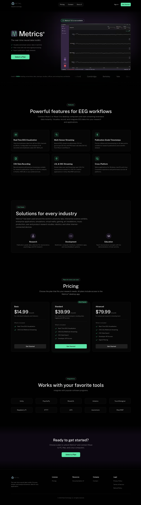

# DESIGN.md: petal.tech

## Source
- URL: https://petal.tech/
- Capture date: 2026-08-23
- Evidence: prerendered HTML, `/_next/static/chunks/*.css` `:root` tokens, local screenshot, public assets (`/images`, `/videos`)

## Reference Screenshot

Use this screenshot as the visual source of truth for layout, hierarchy, density, and feel. Tokens below describe the same page in machine-readable form.

## Design Summary
Near-black marketing landing (`#010101`) with mint accent (`#5de4a8`) and muted purple glow (`#6b4a8c`). Public Sans headings, DM Sans body. Pill nav, large Metrics wordmark, product demo video, 3-up feature cards, highlighted Standard pricing card, text-only integration tiles.

This repo is a **local study clone**. It is not affiliated with Petal Technology LLC and is not for production or distribution.

## Design Tokens

### Colors
| Role | Value | Notes |
|---|---|---|
| background | `#010101` | observed `:root --background` |
| background-surface | `#111111` | |
| background-elevated | `#1a1a1a` | |
| primary | `#6b4a8c` | purple glow / icon wells |
| primary-hover | `#4e326f` | |
| primary-muted | `#d3c9dd` | use-case icons |
| accent | `#5de4a8` | CTAs, checks, badges |
| accent-hover | `#6cc197` | |
| accent-dark | `#328055` | |
| foreground | `#ffffff` | |
| foreground-muted | `#999999` | |
| border | `#1f1f1f` | |
| border-light | `#2a2a2a` | |

White at 5–10% opacity for cards and chips. CTA section wash: `#0d0812`.

### Typography
- Headings: Public Sans, `font-medium`
- Body: DM Sans
- H1: 5xl / 6xl / 7xl tracking-tight
- H2: 4xl / 5xl tracking-normal
- Section eyebrow: 14px mint pill, `bg-white/5`, `border-white/10`

### Spacing And Layout
- Container: `max-w-7xl` + `px-4 sm:px-6 lg:px-8`
- Sections: `py-24 sm:py-32`
- Hero top padding: `pt-48` (clears fixed nav)
- Cards: `rounded-2xl`, `border-white/10`, `bg-white/[0.02]`
- Radius token: `0.5rem`

## Components
- **Nav:** fixed, logo + italic tagline, centered pill (`bg-[#0a0a0a]/90 backdrop-blur-md`), Sign in, mint Get Started
- **Hero:** 2/3 grid, Metrics wordmark + checks, gradient-border “1.0 is now available” chip, demo video, logo marquee
- **Features:** 3-col cards, mint icon wells
- **Use cases:** large inset panel, 3 circular purple wells
- **Pricing:** 3 cards; Standard has mint border + “Most Popular”
- **Integrations:** 5-col text tiles
- **CTA:** purple-black wash, mint button
- **Footer:** 4 link columns, copyright 2026

## Page Patterns
1. Hero + social proof marquee
2. Features
3. Use cases
4. Pricing
5. Integrations
6. Closing CTA
7. Footer

Desktop-first dark page. Mobile: hamburger, stacked hero, 1-col cards.

## Content Style
Product-led, research-toned. Metrics® always with the mark. CTAs: “Select a Plan” / “Get Started”. Prices: $14.99 / $39.99 / $79.99 per month.

## Agent Build Instructions
Rebuild in Next.js App Router + Tailwind using these tokens and the screenshot. Keep Petal/Metrics names, prices, and screenshots because this is a study replica. Do not ship, index, or present as an official Petal site (`robots: noindex`).

## Rerun Inputs
workflow: firecrawl-website-design-clone
source_url: https://petal.tech/
target_stack: nextjs-app-router-tailwind
output: DESIGN.md
